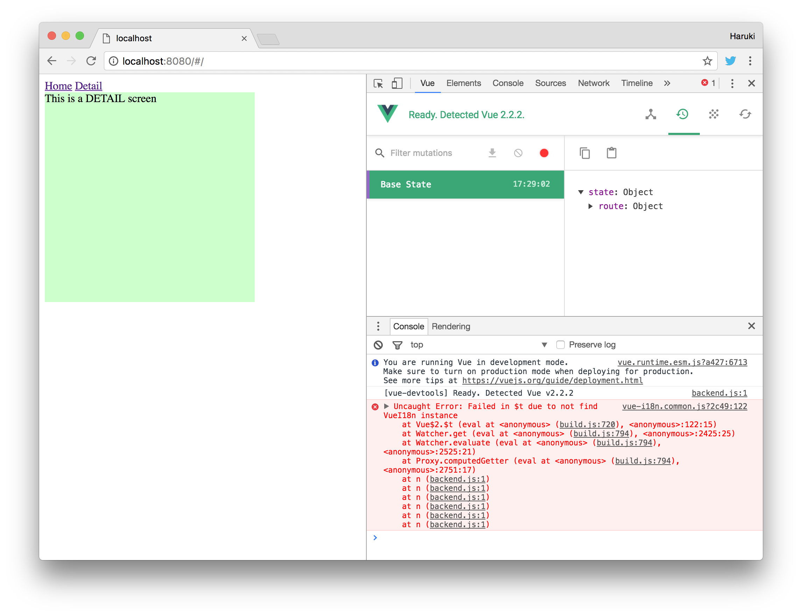

vue-i18n issue #118 demo
===

Setup
---

1. `yarn install`
2. Install vue-devtools to Chrome browser

How to reproduce
---
1. `yarn dev`
2. Open `http://127.0.0.1:8080` in Chrome
3. Open Developer Tools (Menu -> View -> Developer -> Developer Tools)
4. Select the Vue tab (vue-devtools) in the developer tools pane
5. Enable mutations recording (the RED circle button)
6. Click the "Detail" link in the page
7. You'll see error messages in console

